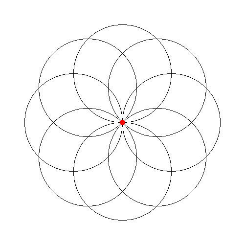

# `turtle_pil`: Turtle on top of PIL

The `turtle_pil` module implements the standard `turtle` module on top of PIL, the Python Imaging Library. Although the `turtle_pil` module does not  attempt to be a pixel-by-pixel replacement of `turtle`, it provides functionally equivalent drawing operations.

# Demo

The output of this program

```python
from turtle_pil import *

for i in range(8):
    circle(100)
    right(45)
dot(10, 'red')

done()  # don't forget it!
```

is a file `output.png` with this image:




# Important differences

As said, `turtle_pil` does not try to perfectly emulate the standard `turtle` module. These are the major differences:

- `turtle_pil` does not work interactively. 

    There is no window and you cannot see the turtle moving.
    
    The image file is created with the `done()` operation. 

- `turtle_pil` is not pixel-by-pixel compatible with `turtle`, this is not its goal. However it tries to provide the same functionalities to the implemented operations. For instance, the `write` command uses different font and size parameters.

- Colors are specified in a slightly different but richer way: Colors can be given by a string as described in https://pillow.readthedocs.io/en/stable/reference/ImageColor.html
or as an RBG tuple of integers in the 0-255 range. Here are some examples for the orange color:

    - `'Orange'`
    - `'#FFA500'`
    - `'rgb(255,165,0)'`
    - `'hsl(39,100%,150%)'`
    - `'hsv(39,100%,100%)'`
    - `(255,165,0)`

- Fillings are not implemented.

- All angles are in degrees. There are no `mode` operations.


# Operations

The following turtle operations have been implemented and behave as in the standard `turtle`, unless noted.

- `forward() | fd()`
- `backward() | bk() | back()`
- `right() | rt()`
- `left() | lt()`
- `goto() | setpos() | setposition()`
- `setx()`
- `sety()`
- `setheading() | seth()`
- `home()`
- `circle()`
- `dot()`

- `position() | pos()`
- `towards()` 
- `xcor()`
- `ycor()`
- `heading()`
- `distance()` 

- `pendown() | pd() | down()`
- `penup() | pu() | up()`
- `pensize() | width()`
- `pen()`
- `isdown()`

- `color()`
- `pencolor()`
- `fillcolor()`

- `reset()`
- `clear()`
- `write()`: fonts and size parameters use the PIL specification and differ from `turtle`. 

- `showturtle() | st()`: does nothing.
- `hideturtle() | ht()`: does nothing.
- `isvisible()`: does nothing.
- `speed()`: does nothing.

- `window_height()`: returns the height of the image.
- `window_width()`: returns the width of the image.

- `done()`: saves the image. Uses the `output.png` filename by default but you can provide your own filename. Please remember to call `done()` and the end of your program to save the image.


# Classes

The `turtle_pil` module also offers the `Vec2D` and `Turtle` classes. Multiple turtles can be used to produce an image. `TurtleScreen`, `RawTurtle`, `RawPen`, `ScrolledCanvas`, `Shape` and `Screen` classes are not provided.


# Installation

- Install with `pip3 install turtle_pil`.
- Upgrade to latest version with `pip3 install --upgrade turtle_pil`.
- Uninstall with `pip3 uninstall turtle_pil`.

Depending on the system you may have to use `pip` rather than `pip3`.


# Credits

- [Jordi Petit](https://github.com/jordi-petit)
- [Izan Beltran](https://github.com/izanbf1803)

Copyright 2022, Universitat Politècnica de Catalunya
